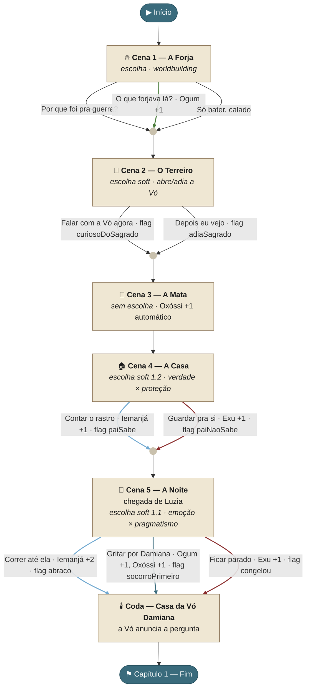

# Fluxograma de escolhas — Capítulo 1: "O Que a Mata Trouxe"

Mapa das escolhas do capítulo 1, com afinidades e flags de cada ramo. Derivado diretamente de `game/js/script.js`. As cores das arestas seguem os orixás (verde/Ogum, azul-verde/Oxóssi, azul-claro/Iemanjá, vermelho/Exu).

> **Nota de design (cf. `ramificacoes_narrativas.md` §7 e §8):** o capítulo 1 é todo de *soft branches* — nenhuma escolha bifurca a história em rotas separadas ainda; todas convergem. O que elas movem é **afinidade** (oculta ao jogador) e **flags** que serão lidas nos Atos 2 e 3. Afinidade nunca é exibida como número — só efeito diegético.

## Escolhas e efeitos (tabela)

| Cena | Escolha | Afinidade | Flag | Label |
|------|---------|-----------|------|-------|
| 1 · Forja | Por que foi pra guerra? | — | — | `Cap1_Forja_PerguntaGuerra` |
| 1 · Forja | O que forjava lá? | **Ogum +1** | — | `Cap1_Forja_PerguntaForjava` |
| 1 · Forja | Só bater, calado | — | — | `Cap1_Forja_Calado` |
| 2 · Terreiro | Falar com a Vó agora | — | `curiosoDoSagrado` | `Cap1_Terreiro_Curioso` |
| 2 · Terreiro | Depois eu vejo | — | `adiaSagrado` | `Cap1_Terreiro_Adia` |
| 3 · Mata | *(sem escolha)* | **Oxóssi +1** | — | `Cap1_Cena3_Mata` |
| 4 · Casa | Contar o rastro | **Iemanjá +1** | `paiSabe` | `Cap1_Casa_Contar` |
| 4 · Casa | Guardar pra si | **Exu +1** | `paiNaoSabe` | `Cap1_Casa_Guardar` |
| 5 · Noite | Correr até ela | **Iemanjá +2** | `abraco` | `Cap1_Noite_Abraco` |
| 5 · Noite | Gritar por Damiana | **Ogum +1, Oxóssi +1** | `socorroPrimeiro` | `Cap1_Noite_Socorro` |
| 5 · Noite | Ficar parado | **Exu +1** | `congelou` | `Cap1_Noite_Congelou` |

## Máximo de afinidade acumulável no capítulo

Somando o melhor caso por orixá ao longo das escolhas (Cena 3 dá Oxóssi +1 sempre):

| Orixá | Máx. no cap. 1 | De onde vem |
|-------|:---:|-------------|
| 🔵 Iemanjá | **+3** | Casa (Contar +1) + Noite (Correr +2) |
| 🟢 Ogum | **+2** | Forja (Forjava +1) + Noite (Gritar +1) |
| 🔷 Oxóssi | **+2** | Mata (auto +1) + Noite (Gritar +1) |
| 🔴 Exu | **+2** | Casa (Guardar +1) + Noite (Parado +1) |

As escolhas da Cena 4 e da Cena 5 são mutuamente exclusivas entre si, então **nenhum jogador consegue maximizar todos os orixás numa jogada** — o equilíbrio é proposital: preserva a possibilidade do final oculto, que depende de não haver um orixá dominante único (cf. `ramificacoes_narrativas.md`).
